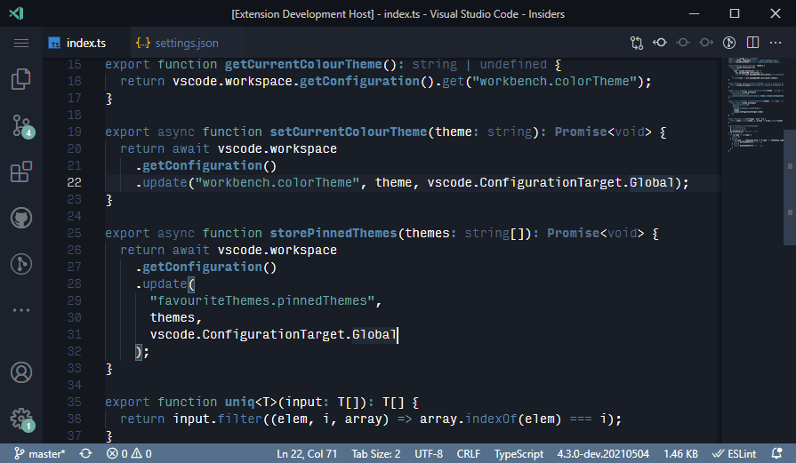

# Favourite Themes README

This extension's main goal is to facilitate switching and keeping track of preferred colour themes, especially in the case of theme packs containing tens of individual themes.

## Features

The extension's main feature is a quick pick menu showing all installed colour themes with the ability to show preferred ones at the top.

Open the command palette and search for "Pick Theme" to show the picker (or alternatively assign a keyboard shortcut for the `favourite-themes.selectColourTheme` command to do the same thing). The moment you check a theme in the picker (using `Space`), it's stored in your settings, and any subsequent invocations of the menu will show checked themes on top of the list.

(Yes, before you ask, there is a theme called [`undefined`](https://marketplace.visualstudio.com/items?itemName=christianhg.undefined).)

<!-- ## Requirements -->

## Motivation

VSCode's built-in theme picker works perfectly if you have 5 or 10 themes installed. However, if you install a theme pack or two, you can easily end up with 100 themes of which you only like 10.

## Extension Settings

This extension contributes the following settings:

| Setting                                   | Description                                                                                               | Default |
| ----------------------------------------- | :-------------------------------------------------------------------------------------------------------- | ------: |
| `favouriteThemes.pinnedThemes`            | A string array containing all pinned themes.                                                              |    `[]` |
| `favouriteThemes.darkThemesFirst`:        | A `boolean` denoting whether dark themes should come first                                                |  `true` |
| `favouriteThemes.sortPinnedByRecentUsage` | A `boolean` denoting whether to show themes in order of their usage (i.e. most recently used ones on top) | `false` |

<!-- ## Known Issues -->

## TODO

- Add extension icon

---

## Release Notes

### 1.1.0

Add sorting of pinned themes by recent usage

### 1.0.0

Initial release
